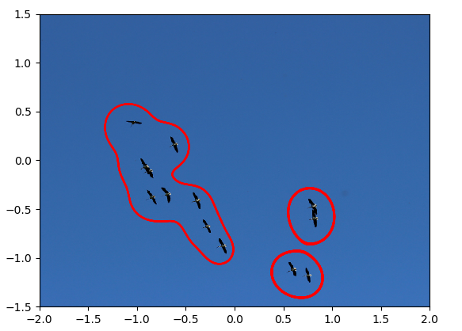

# Table of contents
1. [Hamiltonian Methods for Data Clustering ](#HamClustering)
    1. [Hamiltonian Mechanics](#HamMech)
    2. [Algorithm](#Algorithm)
    3. [Example](#Example)

# Hamiltonian Methods for Data Clustering 
Imagine you finally land a data science job, and it entails checking, labelling and classifying every new datum added to the dataset manually. Such a job would be a dull and tedious job! Furthermore, with the volume of data being harvested today amounts exceeded the volume of water in the Atlantic Ocean. It would be impossible to complete by one person, let alone with an army of data scientists. The solution? You might have heard of data clustering. It is an automated process of grouping data and sorting them into groups and clusters.

A cluster can be thought of as a collection of data, that share a number of similarities with each other and they are dissimilar to objects in other clusters. In this article explains, in a simplified way, a type of clustering algorithm that relies on Hamiltonian dynamics. In the next section, I will present a very simplified explanation of what I mean by Hamiltonian dynamics and the underlying idea behind this type of clustering. The idea of using Hamiltonian dynamics for data clustering was presented in . 

Many clustering algorithms are based on the idea of Euclidean distance, whereas here the idea is to use level curves to define the cluster's boundary. Coincidentally, these boundaries are the solution to a Hamiltonian system. To illustrate that, consider the problem of sorting houses into their respective neighbourhoods. A distance based algorithms would identify the said house's neighbourhood by finding the average distance between it and the other houses in the neighbourhood. A level set approach is akin to defining neighbourhoods by surrounding streets and test whether the house is inside the neighbourhood's street circuit or not.

The most significant advantage of this method is we do not need to know the number of clusters a priori, unlike other clustering algorithms. Not only that, the geometric nature of the algorithm and Hamiltonian dynamics allow us to profit from other geometric information, like geometric moments to classify and clusters and even model time-varying clusters. Sadly, dealing with dynamic clusters will be untreated in this article. Another advantage is we can perform clustering on the surface of geometric objects, such as the sphere, without resorting to additional data preprocessing or transformation.

## Hamiltonian Mechanics

First, what is meant by Hamiltonian dynamics? To answer we need to go back to Newtonian dynamics. From high-school physics class, we know that Newton's second law states that the force is proportional to mass times the acceleration and that the Newton's third law states that force need to be in balance. From these two laws we can derive the equations of motion. 

If we consider a particle, (or a many particles), with a  mass $m$,(or a group of $N$ particles) that move along a trajectory $x(t)$, then according to Newton's second law, when an external force $F$ is applied, the equation of motion is then 

$$
\ddot{x}(t) = \frac{1}{m}F
$$

This describes how the acceleration changes with time. Also, the trajectory here is described in terms of Cartesian coordinates. Newtonian description of dynamics depends greatly on the coordinate systems used and when attempting to model systems with geometric constraints, like a pendulum on a sphere, it becomes very messy. Furthermore, when we want to study the symmetries of a mechanical system, such description becomes a burden. You might wonder, why do we care about symmetries? They correspond to the system's conserved quantities and are used to simplify the equations of motion. The solution the shortcomings of Newtonian mechanics is to use a different formulation that would take into consideration constraints and symmetries. 

This leads us to Hamiltonian dynamics, which derives the equations of motion (same as Newton's equation of motion) from Hamilton's principle of minimal action, which is an extremal principle. It states that (at a given time interval), the trajectory followed by the dynamical system between two points, is such the time integral of the difference between kinetic and potential energies is at a minimum. In mathematical terms that means 

$$
\delta \int_0^t T - U \, dt = 0,
$$

the integrand, $T - U$ is called the Lagrangian function $L$ and its dimensions is the energy. This means that the integral is action. Minimisation means that the dynamics take the path that requires the least amount of energy to get from an initial position to an end point. Moreover, the trajectory solves the Euler-Lagrange equation 

$$
\frac{d}{dt}\frac{\partial L}{\partial \dot{x}} - \frac{\partial L}{\partial x} = 0
$$

which is equivalent Newton's equation. The derivation of this equation is beyond the scope of this article, but the curious reader can consult one of the following books for a detailed and rigorous exposition  or 

At this point, we need the position and velocity $(x(t), \dot{x}(t))$ to evaluate the Lagrangian. Instead of the velocity, we use momentum, and we write the Lagrangian as $L = p \cdot \dot{x} - H(x, p)$, where $H$ is the Hamiltonian. In Hamiltonian formulation, the trajectory solves Hamilton's equation

$$
\dot{x}(t) = -\frac{\partial H}{\partial p}, \quad \dot{p}(t) = \frac{\partial H}{\partial x}
$$

which is equivalent to the Euler-Lagrange equation, but instead of it being an equation of second time derivative, we have two equations with only first order time derivative. One type of Hamiltonian dynamics is what is known as conservative systems, and such system conserve the Hamiltonian $H$, and when looking at $H$ as a level function, then the trajectory defines a level set. 

## Algorithm
### $1^{st}$ Step
The first thing we do is to define the Hamiltonian function $H$ as

$$
H(x, p) = \sum\limits_{i=1}^N \mathrm{exp}(-\| x - x_k \|^2 - a\| p - p_k \|^2)
$$

where $(x_k, p_k)$ for $k=1, \dots, N$ are our collected data points. Let us denote the set of collected data be denoted by $\mathcal{P}$. One can choose different Hamiltonians, but here we stick with a Gaussian function, because we can view it as probability density function with $N$ modes located at $(x_k, p_k)$. 

### $2^{nd}$ step
The second step of the algorithm is to chose a reference value $H_r$ and it defines the level set of the Hamiltonian. In the view point of probability density function, this can be viewed as curves of isodensity.  

### $3^{rd}$ step
The third step is to pick the $i^{th}$ the data point $(x_i, p_i)$ in $\mathcal{P}$, and we find the first level curve $\mathcal{S}_i$. This is done by solving the following Hamilton's equation

$$
\begin{aligned}\label{eq:modifiedPoisson}
\frac{d x}{dt} &= f(x, p)\frac{\partial H}{\partial p}  - f(x,p)\frac{\partial H}{\partial x}(H - H_r)^{1/3}, \\
\frac{d p}{dt} &= - f(x,p)\frac{\partial H}{\partial x} - f(x,p)\frac{\partial H}{\partial p}(H - H_r)^{1/3}
\end{aligned}
$$

with $(x_i, p_i)$ chosen as the initial condition. Here we choose the function $f$ to be 

$$
\begin{aligned}
f(x,p) = \begin{cases}
\left\| (\frac{\partial H}{\partial p})^2 + (\frac{\partial H}{\partial x})^2 \right\|^{-2} & \quad \text{if} \quad H(x,p) \neq H_r \\
\left\|(\frac{\partial H}{\partial p})^2 + (\frac{\partial H}{\partial x})^2  \right\|^{-1/2} & \quad \text{if} \quad H(x,p) = H_r \\
\end{cases}
\end{aligned}
$$

The idea of the function $f$ is to force the trajectory to land on the $H_r$ if the trajectory deviates from the level curve. When we reach a point $(x_k, p_k)$ with $H(x_k, p_k) = H_r$, then we reached the level curve, and the second term of the right hand side in Hamilton's equation becomes zero. As a result, the solution of the Hamilton's equation would remain on the level curve. 

### $4^{th}$ step
With the level curve $\mathcal{S}_i$ computed, we move onto the fourth step where for all other data point in $\mathcal{P}$ we check if they are inside the curve $\mathcal{S}_i$ or not and that is done by checking if the winding number $\omega(x_j, C_i)$, for $j= i+1, \dots, N$ defined by the integral along the curve $\mathcal{C}_j$. Mathematically that is

$$
\begin{aligned} \label{eq:winding_num}
\omega( \mathbf{x}_i, \mathcal{C}_j) =  \oint_{\mathcal{C}_j} \frac{-(y - x_{2,k})dx + (x -x_{1,k} )dy}{(x -x_{1,k} )^2 + (y - x_{2,k})^2 }
\end{aligned}
$$

is a positive number. In simple terms, the winding number gives the number of times a closed curve would wind around a point inside of it. For this algorithm, a positive winding number would indicate that a data point belongs to a set. When the winding number $\omega(x_j, C_i) > 1$, we remove the point $(x_j, p_j)$ from the set $\mathcal{P}$.

We repeat steps 3 and 4 until $\mathcal{P}$ becomes an empty set. The result of this algorithm is a cluster groups defined by level curves $\mathcal{S}_k$, for $k = 1, \dots , M$, where $M$ is the number of cluster sets. 

## Examples
In all of these examples, we treat the data as elements in $(x,p)$ space, e,g. a pixels of a two dimensional image is a point $(x,p)$. The first example is using Hamiltonian-based clustering to flocks of birds, similar to the example presented in .

The second example is clustering spirals. There are three spirals and we demonstrate how the clustering algorithm can identify and group data points in their spiral groups accordingly.

The third example is an extension of the second one and it consists of clustering a spiral on a sphere. This uses a modification to the Hamiltonian and Hamilton's equation, making use of the Hamiltonian's symmetry. The result of such algorithm can be seen in Figure 3.

 

## Conclusion
Using Hamiltonian dynamics is different than other methods, and it relies heavily on calculus and symplectic geometry, which I intentionally refrained from using, and with complex mathematics comes some various advantages. This method is still nascent and there are so many research aveneus need to be explored to develop algorithms for data mining. One unexplored are is the role of conserved quantities and how they can be utilised potentially for object identification. I am planning on working on these things in the near future, so watch this space! 

[back](./)

References
----------


